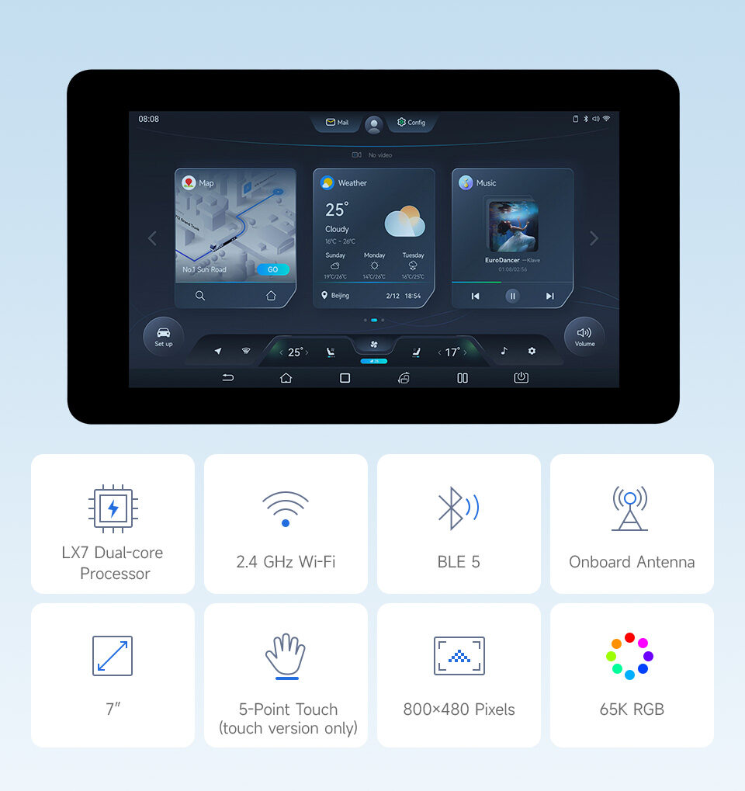
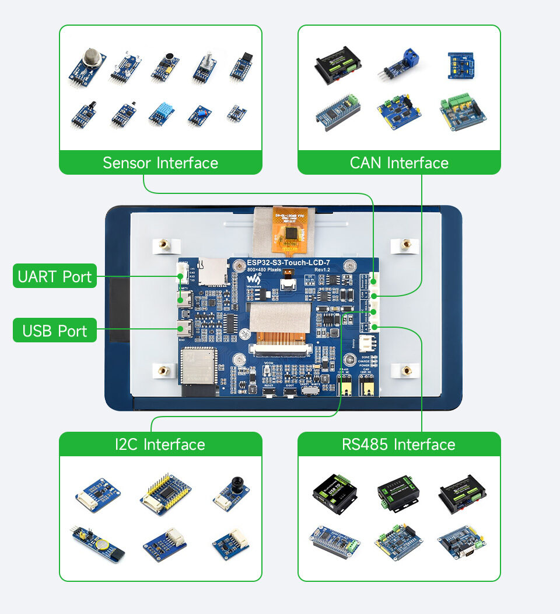
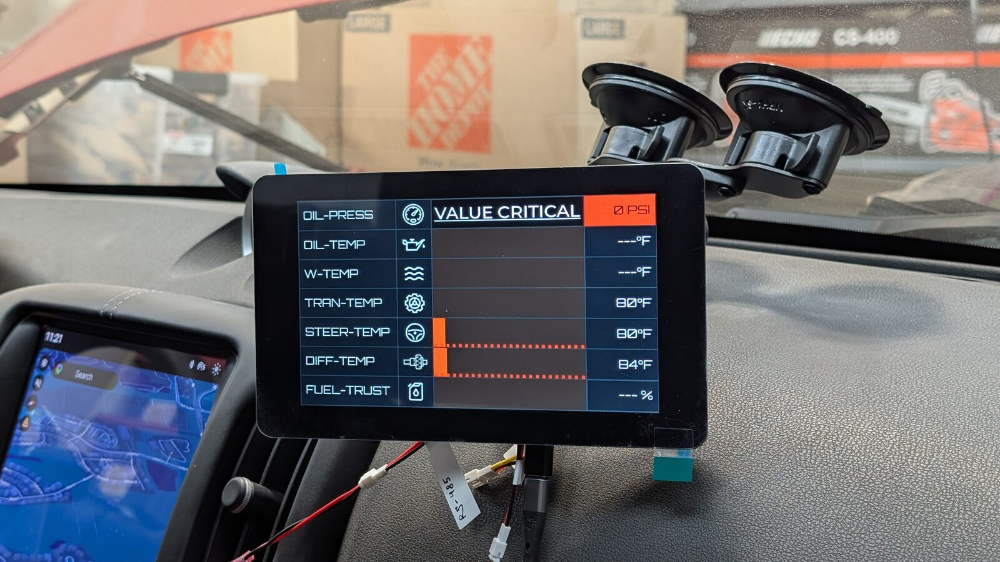
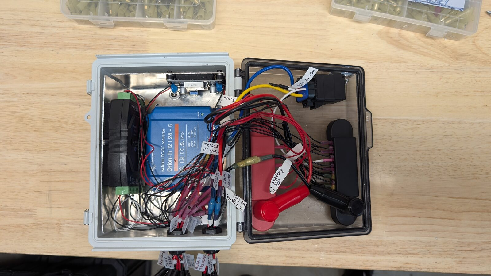
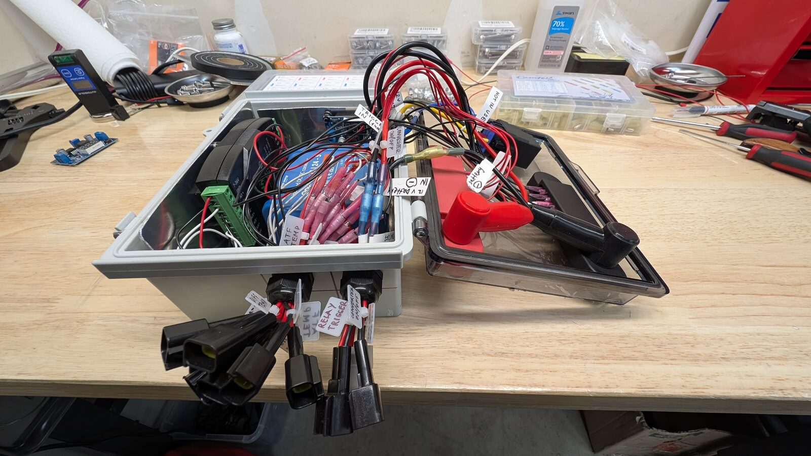
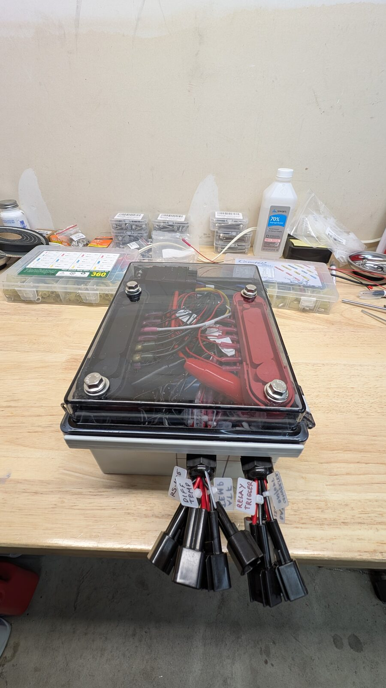
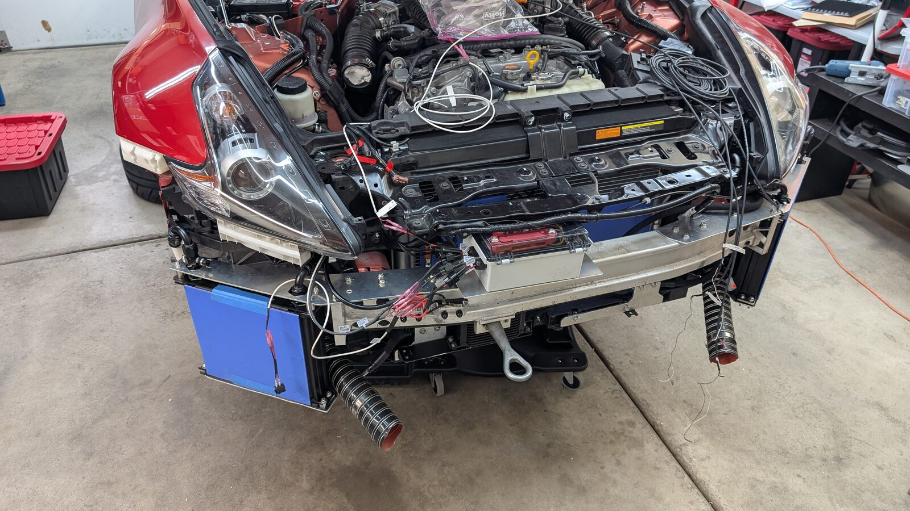
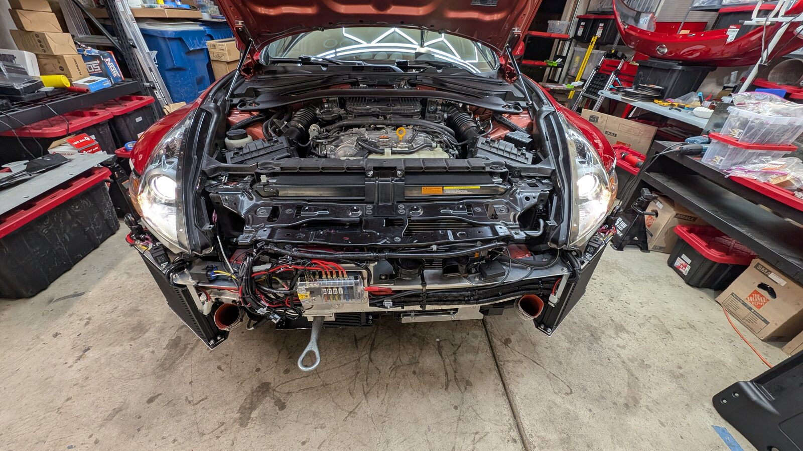

  

# 370zMonitor

A comprehensive real-time automotive data acquisition and monitoring system purpose-built for track day use on a 2018 Nissan 370Z (works on Nissan/Infiniti vehicles). Powered by a Waveshare 7" ESP32-S3 — an all-in-one development board with an integrated 800×480 capacitive touch display — the system provides live sensor telemetry, interactive gauges, automated data logging, and critical alerts, all in a compact, self-contained package.

Designed around the demands of regular track use, 370zMonitor gives you real-time visibility into fluid temperatures, oil pressure, and G-forces, helping you monitor vehicle health and catch dangerous conditions before they become expensive problems.

---

## Demo Mode

▶ **[Watch the demo on YouTube](https://www.youtube.com/watch?v=LVQcww5BEp8)**

---

## Gallery

### ESP32 unit

  
  

### ESP32: mounted into the interior of the car

  

### Electric box: ignition relay, 12V to 24V converter, Modbus RTU

  
  

  

### Electric box: under car's bumper mount

  
  

---

## Features

- **LVGL Touch Interface** — Custom UI with real-time gauges, live charts, and a splash screen with version display on the integrated 800×480 touchscreen
- **Dual-Core Architecture** — UI rendering runs on ESP32-S3 Core 1 while sensor polling and data acquisition run on Core 0 for responsive, non-blocking performance
- **Modbus RTU Sensor Monitoring** — Waveshare 8-Ch Modbus AI (B) module reading five sensor channels:
  - CH1: Oil pressure (PX3 sensor, 0–10V)
  - CH2: Oil temperature (PRTXI, 4–20mA)
  - CH3: Transmission temperature (PRTXI, 4–20mA)
  - CH4: Steering fluid temperature (PRTXI, 4–20mA)
  - CH5: Differential temperature (PRTXI, 4–20mA)
  - PRTXI sensors include a +5°C calibration offset and 0.3°C hysteresis applied in software
- **CAN Bus OBD-II Integration** — Reads vehicle data directly from the vehicle's OBD-II port via CAN bus
- **Accelerometer** — LIS3DH for G-force logging during cornering, braking, and acceleration
- **RTC Timekeeping** — DS3231 real-time clock for accurate session timestamps and time sync
- **SD Card Data Logging** — Automated session-based logging to SD card with structured data files. All important data points get logged
- **Toast Notification System** — On-screen alerts for sensor status, SD card events, log activity, RTC status, and time sync
- **Critical Value Alerts** — Configurable warnings for high temperature and pressure conditions to protect the drivetrain during sustained track driving

---

## Hardware

- Waveshare 7" ESP32-S3 all-in-one board (800×480 capacitive touch display with integrated ESP32-S3)
- Waveshare 8-Ch Modbus AI (B) analog input module for the sensors
- PX3 oil pressure sensor (0–10V output)
- 4× PRTXI-1/2N-1/4-4-IO temperature sensors (4–20mA output)
- LIS3DH 3-axis accelerometer
- DS3231 precision RTC module
- LM2596 buck converters for 12V automotive power regulation

---

## Data Sources

### Modbus RTU Sensors (via Waveshare 8-Ch AI)

| Channel | Measurement | Sensor | Signal |
|---|---|---|---|
| CH1 | Oil Pressure | PX3 | 0–10V |
| CH2 | Oil Temperature | PRTXI | 4–20mA |
| CH3 | Transmission Temperature | PRTXI | 4–20mA |
| CH4 | Steering Fluid Temperature | PRTXI | 4–20mA |
| CH5 | Differential Temperature | PRTXI | 4–20mA |

### OBD-II CAN Bus (from ECU)

- Coolant Temperature — PID 0x05
- Fuel Trust — Fuel system status

### I2C Sensors

- G-Force (X/Y/Z) — LIS3DH 3-axis accelerometer

---

## Use Case

Built for a track-driven 370Z participating in approximately 20 events per year at midwest circuits including Road America, Autobahn Country Club, Blackhawk Farms, and Gingerman Raceway. The system monitors fluid temperatures and oil pressure in real time to catch dangerous conditions before they cause damage during sustained high-speed driving.

---

## Wiring Diagram

